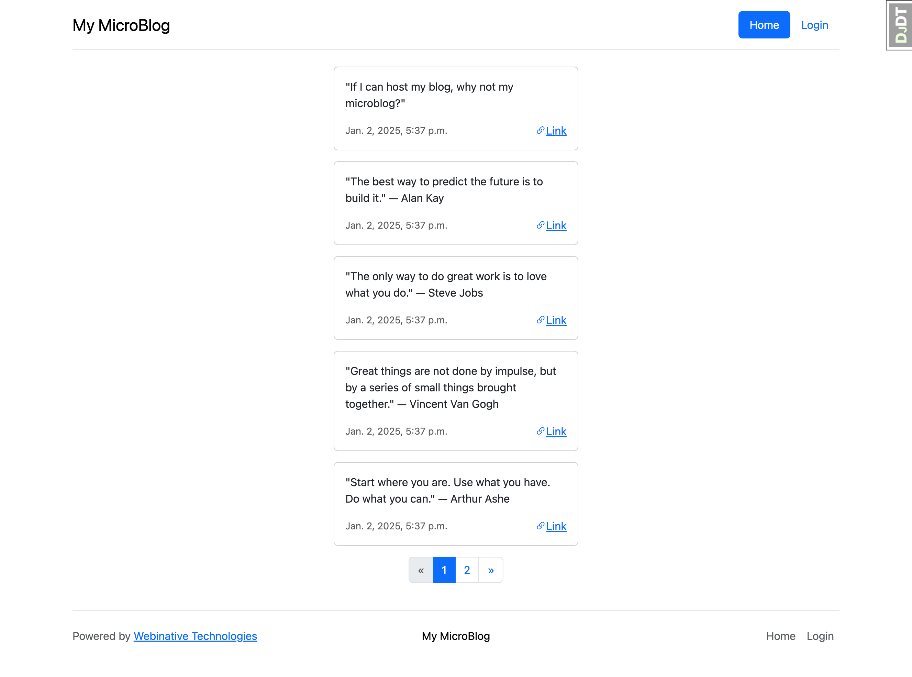

# microblog

A personal micro-blogging website.

## Dev Environment

You can run this project locally on your machine.

### Software Requirements

1. [Docker](https://docs.docker.com/engine/install/)
1. [docker compose](https://docs.docker.com/compose/install/)

### Run

```sh
docker compose build

docker compose up -d

docker compose exec microblog-django bash init_alpha.sh
```

Visit [http://localhost:8000](http://localhost:8000) from your browser.



To check the status of the containers, use the command,

```sh
docker compose ps
```

To stop the containers, use the command,

```sh
docker compose stop
```

To remove the containers altogether, use the command,

```sh
docker compose down
```
